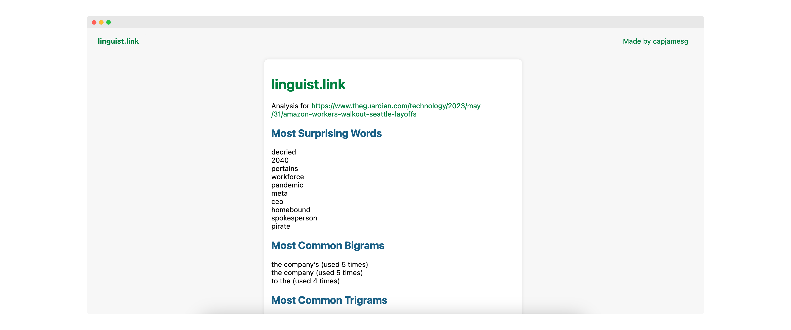

# linguist.link

Find the most surprising words and most common n-grams on a web page.

## Acknowledgements

This project uses the [New York Times articles](https://www.kaggle.com/datasets/nzalake52/new-york-times-articles) dataset on Kaggle for calculating word surprisals in English.

## License

This project is licensed under an [MIT license](LICENSE).

## Contributors

- capjamesg